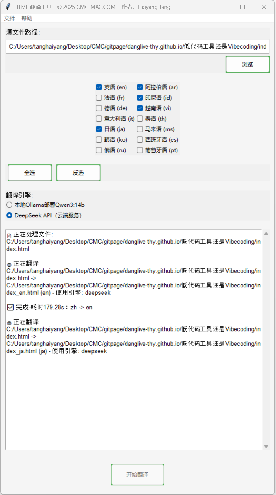

# HTML 翻译工具

版本 1.0 © 2025 CMC-MAC.COM

使用场景：可以使用微信公众号作为编辑器，将图文先编辑好并发布，然后使用一些工具（推荐开源工具[wechat-article-exporter](https://github.com/wechat-article/wechat-article-exporter)）将HTML文件和图片下载到本地，然后使用本工具进行翻译。翻译好的文件，可以使用一些免费的静态页面hosting服务（例如[GitHub Pages](https://pages.github.com/)），通过微信或者whatsapp进行分享，在手机上也有很好的浏览效果。

## 本应用程序的翻译功能依赖于通过Ollama部署的本地LLM
            
- 建议使用ollama run qwen3:14b，运行速度足够快，翻译回答较为简洁，没有开头思考和结束总结，方便程序处理，在3080Ti 12GB的显卡上，GPU利用率可以达到90%以上
- 使用了/no_think指令，消除推理过程，但是回答中含有空的`<think> </think>`标签，程序中已经做了处理，不会在翻译结果中出现类似一下标签内容
- 翻译时长，取决于HTML文件中的内容是否会被截取为很多段，单段的翻译通常较快，但是如果段落非常多，则翻译一个语种可能长达20分钟以上

## 翻译结果存储在源文件所在目录,翻译结果文件名将包含原文件名，后缀为翻译语言的缩写

- 例如：index.html，会被翻译为index_en.html、index_ar.html

## 新的翻译结果将直接覆盖旧的翻译结果，对于文件覆盖不会提示

## 本软件使用了有限的几个组件，请自行检查

如果import部分报错，请自行通过pip install安装以下组件

- beautifulsoup4
- lxml
- requests
- ttkthemes

## 翻译示例1

[阿勒泰已经下雪了（中文原文）](https://danglive-thy.github.io/%E9%98%BF%E5%8B%92%E6%B3%B0%E5%B7%B2%E7%BB%8F%E4%B8%8B%E9%9B%AA%E4%BA%86/index.html)

[It has started snowing in Altay!(en)](https://danglive-thy.github.io/%E9%98%BF%E5%8B%92%E6%B3%B0%E5%B7%B2%E7%BB%8F%E4%B8%8B%E9%9B%AA%E4%BA%86/index_en.html)

[В Алтае уже пошёл снег!(ru)](https://danglive-thy.github.io/%E9%98%BF%E5%8B%92%E6%B3%B0%E5%B7%B2%E7%BB%8F%E4%B8%8B%E9%9B%AA%E4%BA%86/index_ru.html)

[لقد بدأت الثلوج في ألتاي!(ar)](https://danglive-thy.github.io/%E9%98%BF%E5%8B%92%E6%B3%B0%E5%B7%B2%E7%BB%8F%E4%B8%8B%E9%9B%AA%E4%BA%86/index_ar.html)

[Sudah salju di Altay!(id)](https://danglive-thy.github.io/%E9%98%BF%E5%8B%92%E6%B3%B0%E5%B7%B2%E7%BB%8F%E4%B8%8B%E9%9B%AA%E4%BA%86/index_id.html)

[Ất Lạt Đái đã tuyết rồi!(vi)](https://danglive-thy.github.io/%E9%98%BF%E5%8B%92%E6%B3%B0%E5%B7%B2%E7%BB%8F%E4%B8%8B%E9%9B%AA%E4%BA%86/index_vi.html)

[อัลไตมีหิมะตกแล้ว!(th)](https://danglive-thy.github.io/%E9%98%BF%E5%8B%92%E6%B3%B0%E5%B7%B2%E7%BB%8F%E4%B8%8B%E9%9B%AA%E4%BA%86/index_th.html)

[Aletai sudah berlapis salji!(ms)](https://danglive-thy.github.io/%E9%98%BF%E5%8B%92%E6%B3%B0%E5%B7%B2%E7%BB%8F%E4%B8%8B%E9%9B%AA%E4%BA%86/index_ms.html)

[¡Ya ha nevado en Altay!(es)](https://danglive-thy.github.io/%E9%98%BF%E5%8B%92%E6%B3%B0%E5%B7%B2%E7%BB%8F%E4%B8%8B%E9%9B%AA%E4%BA%86/index_es.html)

[Já nevou em Altai!(pt)](https://danglive-thy.github.io/%E9%98%BF%E5%8B%92%E6%B3%B0%E5%B7%B2%E7%BB%8F%E4%B8%8B%E9%9B%AA%E4%BA%86/index_pt.html)

